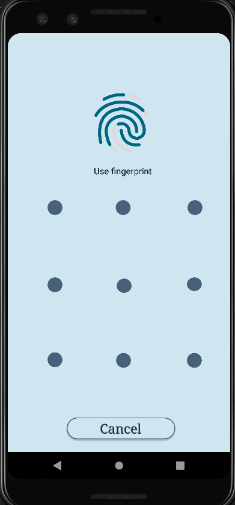

# Carbon Chat App

 Android live chat application, Project for the data structures course .

## Authors

- [@Mohamed-Samy26](https://github.com/Mohamed-Samy26) 
- [@RedBiscuits](https://github.com/RedBiscuits)
- [@KareemHussen](https://github.com/KareemHussen)
- [@Nour10102002](https://github.com/Nour10102002)
- [@HaneenIbrahim2](https://github.com/HaneenIbrahim2)
- [@OmarSherif2](https://github.com/OmarSherif2)

## Features

- Splash Screen.
- Phone Login and register.
- Add/remove/create contacts.
- One-to-One chat.
- One-to-Group chat.
- Stories images and text.
- Audio Records.
- Message encoding
- Video/Audio calls.
- Data privacy and withhold.
- Profile edit and view.
- Conference rooms with streaming,recording,voting and security features.
- Settings activity with app lock(Pattern and Fingerprint).
- English and Arabic support.

# In App Screenshots
## Splash screen

## Registeration

## Login

## Home

## Chatroom

## Video call

## Video call options

## Overlaying videocall

## Stories

## Profile

## Private account

## Setting applock

## Applock

# Technologies
## Android
- Supported by Android Oreo+
- Google design materials.
- Lifecycle
## Firebase
- Firebase Firestore.
- Firebase Realtime.
- Firebase Cloud Storage.
- Firebase Custom Authentication (phone).
## WebRTC
- Implemented by Jitsi SDK.
## External dependencies
- Multidex.
- Recycler view and Card view.
- hdodenhof circular image.
- intuint SDP and SSP.
- OMARIHAMZA Strory view.
- Lifecycle.
- sarnavakonar text writer.
- Jitsi SDK.
- Lottie animations.
- Kotlin Extenstions.
